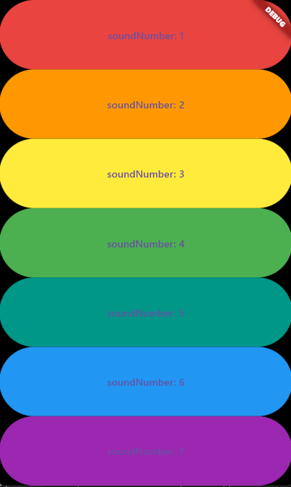

# 🎵 Xylophone App (Flutter)

Proyek ini adalah **aplikasi Xylophone** sederhana menggunakan **Flutter** dan package `audioplayers`.  
Pengguna bisa menekan salah satu tombol warna untuk memainkan suara not sesuai nada.

## ✨ Fitur Utama
- 🎹 7 tombol berwarna, masing-masing memutar nada berbeda
- 🔊 Memutar file audio lokal (`.wav`)
- 📱 Responsif untuk Android dan iOS
- 🎨 Tampilan minimalis dan simpel

---

## 📸 Tampilan Aplikasi

  

---
